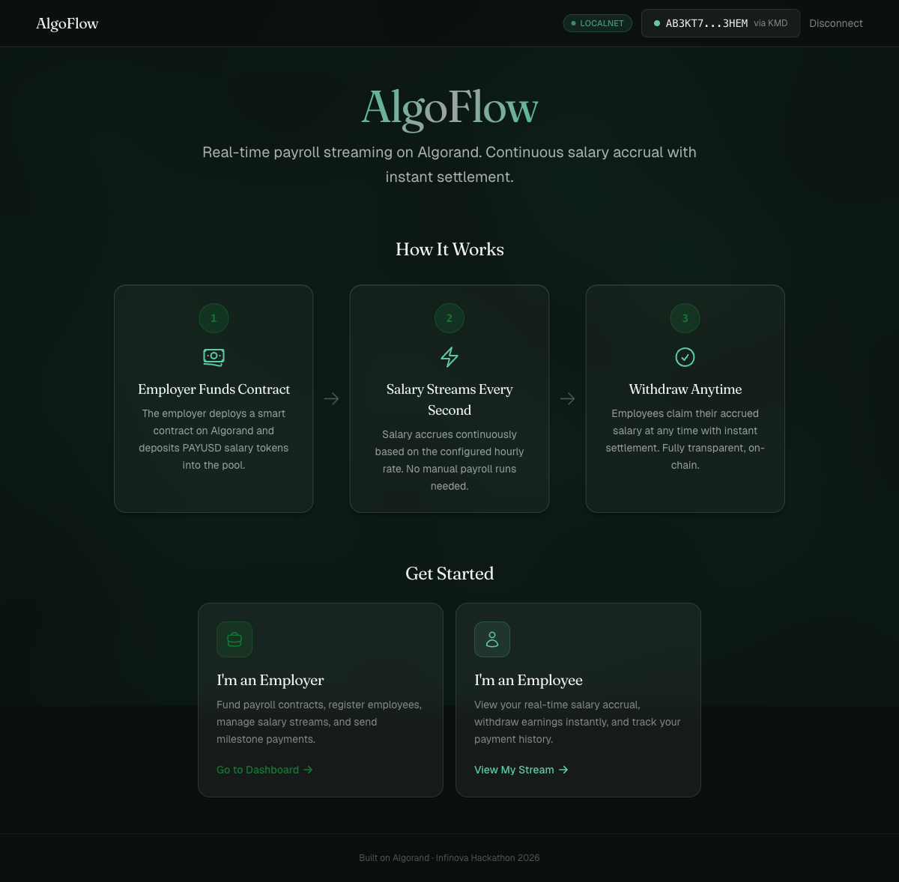
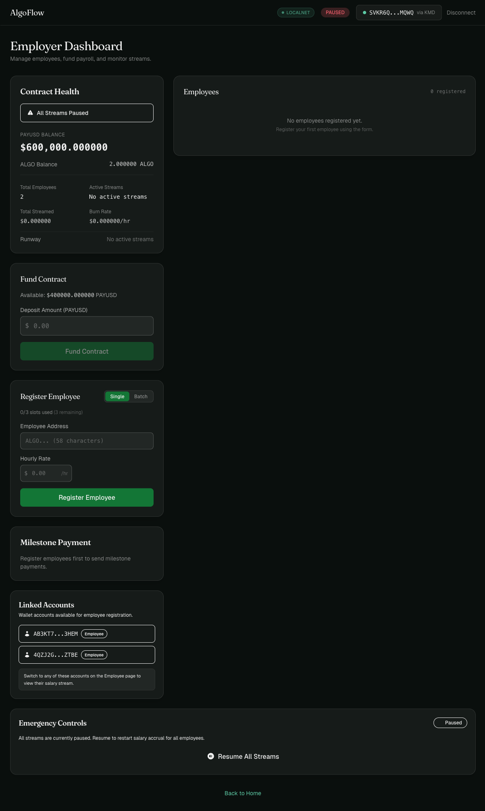
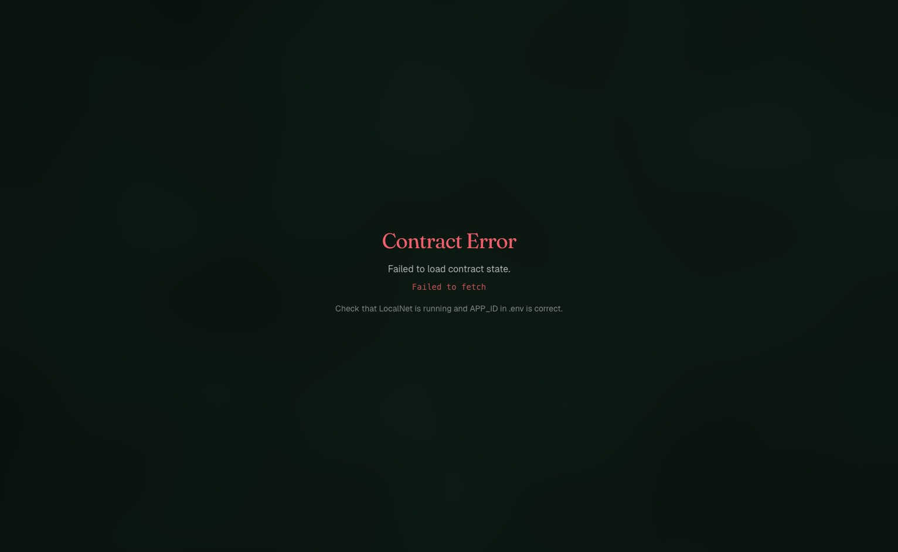
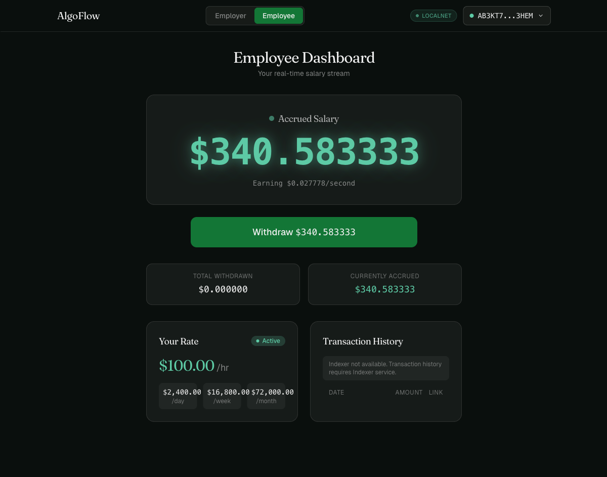

<p align="center">
  
  
  
  
  
  
  
</p>

<h1 align="center">AlgoFlow</h1>
<h3 align="center">Real-Time Programmable Payroll Infrastructure on Algorand</h3>

<p align="center">
  <em>Stream salaries every second. Withdraw anytime. Trustless, transparent, on-chain.</em>
</p>

<p align="center">
  <strong>Infinova Hackathon 2026</strong> | Blockchain with Algorand Track
</p>

---

## :zap: The 30-Second Pitch

> Your salary starts streaming the moment you're registered. Not monthly. Not weekly. **Every second.**
>
> The counter on your dashboard ticks up in real time -- `$0.027778` per second, visible and verifiable. When you need money, hit **Withdraw**. In 3.3 seconds, it's in your wallet. No bank, no payroll processor, no waiting.
>
> The employer funds a smart contract once. The math handles the rest.
>
> **Cost to run payroll for 100 employees for an entire month: ~$3.**

---

## :camera: Screenshots

| Landing Page | Employer Dashboard |
|:---:|:---:|
|  |  |

| Employee Dashboard | Live Streaming Counter |
|:---:|:---:|
|  |  |

---

## :rotating_light: The Problem

Traditional payroll is broken at every level:

- **30-day lag** -- Employees work today, get paid next month. Cash flow is a guessing game.
- **Opacity** -- Workers have zero visibility into accrual until payday arrives.
- **Trust dependency** -- Employees must trust employers, banks, and payroll processors to pay correctly and on time.
- **Cross-border friction** -- Wire fees ($25-50), currency conversion delays (2-5 business days), intermediary markups.
- **No programmability** -- Traditional systems cannot handle per-second accrual, conditional payouts, or instant bonuses.
- **Overpayment risk** -- Employee quits on day 15? The monthly payroll already processed. Good luck with clawback.

For DAOs, remote-first teams, and the 1.57 billion gig workers globally, these problems are amplified. There is no transparent, real-time, programmable payroll system -- until now.

---

## :bulb: AlgoFlow: The Solution

**AlgoFlow** is a decentralized payroll streaming platform built on the Algorand blockchain. Employers fund a smart contract with PAYUSD tokens (an Algorand Standard Asset). The contract streams salary to employees continuously using on-chain math. Employees withdraw accrued earnings **at any time** with instant settlement.

No intermediaries. No delays. No trust required.

### The Core Innovation: Math-Based Streaming

Most blockchain streaming protocols send a transaction every second or every block. This is wasteful and expensive. AlgoFlow does something fundamentally different:

```
accrued = salary_rate * (current_time - last_withdrawal) / 3600
```

That's it. One line of integer math, executed **only when the employee withdraws**. Between withdrawals, zero transactions, zero gas, zero compute. The frontend renders a smooth 60fps counter showing earnings tick up in real time, but the blockchain is only touched when money actually moves.

**This is why AlgoFlow costs $0.001 per withdrawal instead of $15,000/month.**

---

## :crossed_swords: Competitive Analysis: Why Not Ethereum?

Token streaming exists on Ethereum. [Sablier](https://sablier.com) (2019) and [Superfluid](https://superfluid.finance) (2021) pioneered the concept. But Ethereum's economics make real payroll impractical.

| Feature | Sablier (Ethereum) | Superfluid (Ethereum) | **AlgoFlow (Algorand)** |
|---------|-------------------|----------------------|------------------------|
| **Transaction fee** | $5-50+ per tx | $5-50+ per tx | **$0.001 per tx** |
| **Finality** | ~12 seconds (L1) | ~12 seconds (L1) | **~3.3 seconds** |
| **Token standard** | ERC-20 (requires wrapping) | Super Tokens (custom wrapper) | **Native ASA (no wrapping)** |
| **Complexity** | Moderate (Solidity) | High (CFA/IDA agreements) | **Simple (single contract, math-based)** |
| **Contract-initiated payouts** | External calls only | External calls only | **Native inner transactions** |
| **Atomic operations** | No native support | No native support | **Built-in atomic groups** |
| **Streaming model** | Per-second state updates | Continuous (Super Agreement) | **Math-based (compute on withdrawal)** |
| **100 employees/month cost** | ~$15,000+ in gas | ~$15,000+ in gas | **~$3 in fees** |
| **Smart contract language** | Solidity | Solidity | **Typed Python (algopy)** |
| **Reorg risk** | Yes (pre-merge: common) | Yes | **None (instant finality)** |

### The Key Insight

Sablier and Superfluid proved the *concept* of token streaming. But their adoption is limited by Ethereum's gas costs -- streaming becomes a DeFi toy for whales, not a practical payroll tool for a 50-person DAO.

AlgoFlow brings streaming payroll to Algorand where it becomes **economically viable for real organizations**. A company with 100 employees paying $0.001 per withdrawal spends ~$3/month on payroll infrastructure. On Ethereum, the same operation costs more than most employees' salaries.

---

## :dart: Who This Solves For

### For Employers (DAOs, Remote Teams, Digital Organizations)

| Pain Point | Traditional Payroll | AlgoFlow |
|-----------|-------------------|---------|
| Payroll cycle | Monthly batch, manual processing, 3-5 day settlement | Continuous, automated, 3.3s settlement |
| Cash flow management | Large lump sums locked for payroll dates | Fund pool once, stream as-needed |
| Transparency | Opaque spreadsheets, trust-based | Every transaction on-chain, auditable by anyone |
| Global workforce | Wire fees ($25-50), currency conversion, 2-5 day delays | Instant, borderless, $0.001 per transaction |
| Employee departures | Overpayment risk, complex clawback | Stop the stream. Accrual stops immediately. |
| Rate adjustments | HR paperwork, next-cycle effective date | On-chain rate update, effective immediately (old rate settled first) |
| Compliance overhead | Manual record-keeping, spreadsheet reconciliation | Immutable on-chain audit trail with timestamps |

### For Employees (Contractors, Gig Workers, Remote Workers)

| Pain Point | Traditional Payroll | AlgoFlow |
|-----------|-------------------|---------|
| Payment timing | Wait 30 days for earned wages | Earn every second, withdraw anytime |
| Verification | Trust employer's word on calculations | On-chain proof: `rate * elapsed / 3600` |
| Emergency access | Payday loans at 30% APR, wage advance apps | Withdraw accrued salary instantly, for free |
| Rate visibility | Buried in contracts, opaque calculations | Live dashboard: $/hr, $/day, $/week, $/month toggle |
| Cross-border fees | Receiving wire: $15-25 + FX markup | Receive PAYUSD directly, $0 receiving fee |
| Payment proof | Request pay stubs, wait for HR | On-chain transaction history, exportable |

### For Governments and Regulators

- **India's UPI parallel**: India processes 14B+ UPI transactions per month. AlgoFlow extends this model to recurring payments with blockchain guarantees -- instant settlement, full auditability, no intermediary risk.
- **Compliance advantage**: Every rate change, pause, and withdrawal is an immutable on-chain event. Real-time salary data enables real-time tax withholding calculations -- no end-of-year reconciliation surprises.
- **Labor law enforcement**: On-chain timestamps prove exactly when employees were paid and at what rate. Wage theft becomes provably detectable.
- **Algorand for government**: Instant finality (critical for payroll), sub-cent fees (scalable to millions of workers), atomic groups (no partial failures), full auditability.

---

## :gear: How It Works

```
  EMPLOYER                          SMART CONTRACT                        EMPLOYEE
  --------                          --------------                        --------
     |                                    |                                  |
     |  1. Deploy (PAYUSD asset ID)       |                                  |
     |----------------------------------->|                                  |
     |                                    |                                  |
     |  2. Fund pool (10,000 PAYUSD)      |                                  |
     |----------------------------------->|                                  |
     |                                    |                                  |
     |  3. Register employee              |                                  |
     |     (rate: 100 PAYUSD/hr)          |                                  |
     |----------------------------------->|                                  |
     |                                    |                                  |
     |                                    |  Time passes... salary accrues   |
     |                                    |  accrued = 100 * elapsed / 3600  |
     |                                    |                                  |
     |                                    |  4. Withdraw request             |
     |                                    |<---------------------------------|
     |                                    |                                  |
     |                                    |  5. Inner AssetTransfer          |
     |                                    |     (exact accrued amount)       |
     |                                    |--------------------------------->|
     |                                    |                                  |
     |                                    |  Settlement: ~3.3 seconds        |
     |                                    |  Fee: $0.001                     |
```

### Step by Step

1. **Employer deploys** the PayrollStream contract, linking it to a PAYUSD salary token (Algorand Standard Asset, 6 decimals).
2. **Employer funds** the contract pool with PAYUSD tokens via an atomic asset transfer.
3. **Employer registers** employees with per-hour salary rates in base units (e.g., `100_000_000` = 100.000000 PAYUSD/hr).
4. **Salary accrues mathematically** -- the contract computes `salary_rate * (now - last_withdrawal) / 3600` on demand. Zero transactions per second. Zero gas wasted.
5. **Employee withdraws** at any time -- the contract calculates what's owed and executes an inner `AssetTransfer` directly to the employee's wallet.
6. **Frontend counter** uses `requestAnimationFrame` for a 60fps visual of earnings ticking up, synchronized with on-chain state on each withdrawal.

### Why Math-Based Streaming Wins

| Approach | Transactions/day (100 employees) | Daily cost |
|----------|--------------------------------|------------|
| Per-second streaming (naive) | 8,640,000 | $8,640 on Ethereum |
| Per-block streaming | 26,182 | $130,000+ on Ethereum |
| **Math-based (AlgoFlow)** | **Only on withdrawal** | **$0.001 per withdrawal** |

Math-based streaming is not just cheaper -- it's architecturally superior. The contract stores rates and timestamps. The math is pure, deterministic, and verifiable. No state bloat, no transaction spam, no MEV risk.

---

## :globe_with_meridians: Why Algorand?

Algorand is not just "another L1." It has specific properties that make it the **right chain for payroll**:

| Property | Why It Matters for Payroll |
|----------|---------------------------|
| **Instant finality (3.3s)** | No orphaned blocks, no reorgs. When you withdraw, it's confirmed. Period. Payroll cannot tolerate "maybe confirmed" status. |
| **Deterministic fees ($0.001)** | Predictable cost structure. An employer knows exactly what payroll infrastructure costs -- not "$5 today, $50 tomorrow" based on gas auctions. |
| **Native ASAs** | Salary tokens are first-class Algorand citizens, not smart-contract-managed ERC-20 wrappers. Cheaper to create, transfer, and hold. |
| **Inner transactions** | The contract pays employees directly via inner `AssetTransfer`. No employee approvals needed on the asset side. No external contract calls. |
| **Atomic groups** | Multi-step operations (fund + register, withdraw + update) are all-or-nothing. No partial failures = no accounting discrepancies. |
| **AVM integer math** | Simple integer division, no floating point. Perfect for financial calculations where determinism matters. `rate * elapsed // 3600` is the same on every node, every time. |
| **Pure proof-of-stake** | No mining, no energy waste. Payroll infrastructure should not consume a small country's electricity. |
| **Algorand Python (algopy)** | Write contracts in typed Python, compiled to AVM bytecode. Auditable by any Python developer, not just Solidity specialists. |

---

## :sparkles: Features

| Feature | Description |
|---------|-------------|
| **Real-Time Salary Streaming** | Accrues every second using on-chain math (`rate * elapsed / 3600`). Zero per-transaction overhead. |
| **Instant Withdrawal** | Employees claim accrued salary with one click. Inner transaction settles in ~3.3 seconds. |
| **Employer Dashboard** | Fund pool, register employees, adjust rates, pause/resume streams, send milestone bonuses. |
| **Employee Dashboard** | 60fps streaming counter, one-click withdraw, transaction history, multi-unit rate display. |
| **Milestone / Bonus Payments** | One-time bonus payments outside the regular stream. |
| **Emergency Controls** | Global pause freezes all streams instantly. Resume individually or all at once. |
| **Multi-Unit Rate Display** | Toggle salary rate view: $/hr, $/day, $/week, $/month. |
| **Overdraft Protection** | Contract enforces withdrawal caps -- employees can never claim more than the pool balance. Auto-pauses stream on overdraft. |
| **Rate Updates with Settlement** | Changing an employee's rate first settles accrued at the old rate, then applies the new rate. No lost earnings. |
| **PAYUSD Stablecoin** | Salary paid in PAYUSD (ASA, 6 decimals), analogous to USDT. 1 PAYUSD = $1.00. |
| **Glassmorphism UI** | Dark-theme design with frosted glass cards, mouse-tracking spotlight effects, shimmer text, Three.js 3D animated background. |

---

## :hammer_and_wrench: Tech Stack

| Layer | Technology | Purpose |
|-------|------------|---------|
| **Smart Contracts** | Algorand Python (`algopy`) | Typed Python compiled to AVM bytecode. ARC4-compliant ABI. 14 methods. |
| **Frontend** | React 19 + TypeScript + Vite | SPA with role-based routing (employer/employee). |
| **Styling** | Tailwind CSS 4 | Custom glassmorphism design system, dark theme. |
| **3D / Animation** | Three.js (Silk shader) | Procedural 3D fragment shader background. 60fps streaming counter. |
| **Wallet** | `@txnlab/use-wallet-react` | KMD for LocalNet, Pera Wallet for Testnet. |
| **Network** | Algorand Testnet | ~3.3s finality, $0.001 fees, instant settlement. |
| **Tooling** | AlgoKit CLI | Scaffolding, compilation, deployment, local network. |
| **SDK** | `py-algorand-sdk` (`algosdk`) | Transaction building, indexer queries, account management. |
| **Testing** | pytest + Vitest + Playwright | Contract, frontend unit, and E2E tests. |

---

## :building_construction: Architecture

```
                    +------------------+
                    |  Employer Wallet  |
                    |  (Pera / KMD)    |
                    +--------+---------+
                             |
                    1. Deploy contract
                    2. Fund PAYUSD pool
                    3. Register employees
                             |
                             v
              +------------------------------+
              |     PayrollStream Contract    |
              |        (Algorand AVM)         |
              |------------------------------|
              |  Global State:               |
              |    employer (Account)        |
              |    salary_asset (ASA ID)     |
              |    total_employees (uint)    |
              |    total_streamed (uint)     |
              |    is_paused (bool flag)     |
              |                              |
              |  Per-Employee Local State:   |
              |    salary_rate (uint/hr)     |
              |    stream_start (timestamp)  |
              |    last_withdrawal (ts)      |
              |    total_withdrawn (uint)    |
              |    is_active (bool flag)     |
              |                              |
              |  Core Formula:              |
              |  accrued = rate * elapsed    |
              |            / 3600           |
              +-----+--------+--------+-----+
                    |        |        |
         Inner AssetTransfer (contract-initiated)
                    |        |        |
                    v        v        v
              Employee A  Employee B  Employee C
              (withdraw    (withdraw   (withdraw
               on demand)   on demand)  on demand)
```

### Frontend Architecture

```
React 19 SPA
  |
  +-- Landing (role selection: employer / employee)
  |
  +-- Employer Dashboard
  |     +-- WalletConnect (KMD / Pera)
  |     +-- ContractHealth (pool balance, runway)
  |     +-- RegisterForm (add employees)
  |     +-- EmergencyControls (pause/resume all)
  |     +-- TransactionHistory (on-chain log)
  |
  +-- Employee Dashboard
  |     +-- WalletConnect
  |     +-- StreamCounter (60fps accrual display)
  |     +-- RateDisplay ($/hr, $/day, $/week, $/month)
  |     +-- WithdrawButton (one-click claim)
  |     +-- TransactionHistory
  |
  +-- Visual Layer
        +-- Silk.tsx (Three.js 3D procedural background)
        +-- SpotlightCard (mouse-tracking radial gradient)
        +-- ShinyText (shimmer gradient animation)
```

---

## :scroll: Smart Contract: 14 ABI Methods

All methods implemented in Algorand Python (`algopy`). Full source: [`smart_contracts/payroll_stream/contract.py`](smart_contracts/payroll_stream/contract.py)

| # | Method | Caller | Description |
|---|--------|--------|-------------|
| 1 | `create(asset)` | Employer | Initialize contract with PAYUSD salary asset |
| 2 | `opt_in_asset()` | Employer | Contract opts into salary ASA |
| 3 | `fund(axfer)` | Employer | Deposit PAYUSD into the contract pool |
| 4 | `register_employee(account, rate)` | Employer | Register employee with hourly rate, start stream |
| 5 | `withdraw()` | Employee | Claim all accrued salary via inner transaction |
| 6 | `get_accrued(account)` | Anyone | Read-only: view current accrued balance |
| 7 | `update_rate(account, new_rate)` | Employer | Settle at old rate, apply new rate |
| 8 | `pause_stream(account)` | Employer | Settle accrued, pause individual stream |
| 9 | `resume_stream(account)` | Employer | Resume paused stream (no retroactive accrual) |
| 10 | `remove_employee(account)` | Employer | Final payout + deregister |
| 11 | `milestone_pay(employee, amount)` | Employer | One-time bonus payment |
| 12 | `pause_all()` | Employer | Emergency: freeze all streams globally |
| 13 | `resume_all()` | Employer | Resume all streams after emergency |
| 14 | `drain_funds()` | Employer | Emergency: return pool to employer |

### On-Chain State Schema

**Global State** (4 UInt64 + 1 byte-slice):

| Key | Type | Description |
|-----|------|-------------|
| `employer` | Account | Deployer address (authorized for management methods) |
| `salary_asset` | Asset | PAYUSD ASA ID |
| `total_employees` | UInt64 | Active employee count |
| `total_streamed` | UInt64 | Cumulative tokens disbursed |
| `is_paused` | UInt64 | Global pause flag (0 = active, 1 = paused) |

**Local State** (5 UInt64 per employee):

| Key | Type | Description |
|-----|------|-------------|
| `salary_rate` | UInt64 | Tokens per hour in base units (6 decimals) |
| `stream_start` | UInt64 | Unix timestamp when stream began |
| `last_withdrawal` | UInt64 | Unix timestamp of last withdrawal |
| `total_withdrawn` | UInt64 | Cumulative tokens claimed |
| `is_active` | UInt64 | Stream status (0 = paused, 1 = active) |

### Security Model

Every method enforces authorization:

```python
# Employer-only methods (11 of 14):
assert Txn.sender == self.employer.value, "Only employer can ..."

# Employee-only method (withdraw):
# Validates sender has active local state (is_active == 1)

# Read-only method (get_accrued):
# No authorization needed -- public read
```

Additional protections:
- **Overdraft protection** -- Withdrawals capped at pool balance. Auto-pauses stream if pool insufficient.
- **Minimum withdrawal** -- Rejects claims below 0.001 PAYUSD (1000 base units) to prevent dust attacks.
- **Atomic groups** -- Multi-step operations are all-or-nothing.
- **Inner transactions** -- Payouts initiated by the contract, not external signers.
- **Settlement-before-update** -- Rate changes and pauses settle accrued first, preventing loss.
- **No exposed secrets** -- Mnemonics in `.env` only (never committed). Frontend uses `VITE_`-prefixed public values.

---

## :rocket: Setup & Run

### Prerequisites

- **Python 3.12+**
- **Node.js 22+**
- **Docker** (for AlgoKit LocalNet)
- **AlgoKit CLI** (`pipx install algokit`)

### Clone & Install

```bash
git clone https://github.com/pranayvaddanam/infinova-hackathon.git
cd infinova-hackathon

# Python environment
python -m venv .venv
source .venv/bin/activate
pip install -r requirements.txt

# Frontend dependencies
cd frontend && npm install && cd ..
```

### Start LocalNet

```bash
algokit localnet start
algokit localnet status    # verify it's running
```

### Compile & Deploy

```bash
# Compile the smart contract
algokit compile python smart_contracts/payroll_stream/contract.py

# Deploy contract + create PAYUSD token
python scripts/deploy.py --network localnet
# Note the APP_ID and ASSET_ID from the output

# Fund test employee accounts
python scripts/fund_accounts.py --network localnet --app-id <APP_ID> --asset-id <ASSET_ID>
```

### Configure Environment

```bash
cp .env.example .env

# Edit .env with your deployed values:
#   VITE_APP_ID=<your-app-id>
#   VITE_ASSET_ID=<your-asset-id>
#   VITE_NETWORK=localnet
#   VITE_ALGOD_SERVER=http://localhost:4001
#   VITE_ALGOD_TOKEN=aaaaaaaaaaaaaaaaaaaaaaaaaaaaaaaaaaaaaaaaaaaaaaaaaaaaaaaaaaaaaaaa
```

### Run the Frontend

```bash
cd frontend
npm run dev
# Open http://localhost:5173
```

### Run Tests

```bash
# Smart contract tests
pytest --tb=short

# Frontend unit tests
cd frontend && npm run test

# Type checking
cd frontend && npx tsc --noEmit
```

---

## :file_folder: Project Structure

```
infinova-hackathon/
+-- smart_contracts/
|   +-- payroll_stream/
|       +-- contract.py                 # PayrollStream ARC4 contract (14 methods, 429 lines)
|       +-- PayrollStream.arc56.json    # Compiled ABI specification
+-- scripts/
|   +-- deploy.py                       # Deploy contract + create PAYUSD token
|   +-- fund_accounts.py                # Fund and register test employees
|   +-- demo.py                         # Live demo script (9-step flow)
+-- frontend/
|   +-- src/
|   |   +-- App.tsx                     # Main app with role-based routing
|   |   +-- components/
|   |   |   +-- Landing.tsx             # Landing page with role selection
|   |   |   +-- EmployerDashboard.tsx   # Employer management suite
|   |   |   +-- EmployeeDashboard.tsx   # Employee view with streaming counter
|   |   |   +-- StreamCounter.tsx       # 60fps real-time accrual display
|   |   |   +-- WalletConnect.tsx       # Wallet connection (KMD / Pera)
|   |   |   +-- RegisterForm.tsx        # Employee registration form
|   |   |   +-- ContractHealth.tsx      # Pool balance & runway display
|   |   |   +-- EmergencyControls.tsx   # Global pause/resume controls
|   |   |   +-- TransactionHistory.tsx  # On-chain transaction log
|   |   |   +-- WithdrawButton.tsx      # One-click salary withdrawal
|   |   |   +-- RateDisplay.tsx         # Multi-unit rate toggle (hr/day/week/month)
|   |   |   +-- NetworkBadge.tsx        # Network indicator
|   |   |   +-- Silk.tsx                # Three.js 3D animated background
|   |   |   +-- SpotlightCard.tsx       # Mouse-tracking spotlight cards
|   |   |   +-- ShinyText.tsx           # Shimmer gradient text
|   |   +-- hooks/
|   |   |   +-- usePayrollContract.ts   # Contract interaction hook
|   |   |   +-- useStreamAccrual.ts     # Real-time accrual calculation
|   |   |   +-- useContractState.ts     # Contract state management
|   |   +-- lib/
|   |   |   +-- utils.ts                # Formatters, address truncation
|   |   |   +-- constants.ts            # App-wide constants
|   |   |   +-- PayrollStream.arc56.json
|   |   +-- index.css                   # Global styles + Tailwind
|   +-- vite.config.ts
|   +-- package.json
+-- tests/
|   +-- test_payroll_stream.py          # Contract unit tests
|   +-- test_integration.py             # Full-flow integration tests
+-- docs/                               # Planning artifacts (PRD, architecture, data model)
+-- CLAUDE.md                           # Project conventions (700+ lines)
+-- .env.example
+-- requirements.txt
+-- pyproject.toml
```

---

## :gear: Environment Variables

| Variable | Description | Example |
|----------|-------------|---------|
| `VITE_APP_ID` | Deployed application ID | `1001` |
| `VITE_ASSET_ID` | PAYUSD asset ID | `1002` |
| `VITE_NETWORK` | Network identifier | `localnet` / `testnet` |
| `VITE_ALGOD_SERVER` | Algod node URL | `http://localhost:4001` |
| `VITE_ALGOD_TOKEN` | Algod API token | `aaa...` (64 chars for LocalNet) |
| `DEPLOYER_MNEMONIC` | 25-word mnemonic (**server-side only**) | *never commit* |

---

## :chart_with_upwards_trend: The Numbers

| Metric | Value |
|--------|-------|
| Smart contract methods | 14 (12 MVP + 2 stretch) |
| Lines of contract code | 429 |
| On-chain state fields | 10 (5 global + 5 local per employee) |
| Transaction finality | ~3.3 seconds |
| Transaction fee | $0.001 |
| Minimum withdrawal | 0.001 PAYUSD |
| Frontend components | 15 |
| Custom hooks | 3 |
| 3D background | Three.js procedural fragment shader |
| Streaming counter FPS | 60 (requestAnimationFrame) |
| Planning artifacts | 47 files, 13,259 lines |
| Sprints completed | 4 of 5 |

---

## :crystal_ball: Future Potential

AlgoFlow is a hackathon project, but the architecture supports real-world expansion:

- **Multi-asset payroll** -- Stream different ASAs to different employees (PAYUSD, ALGO, custom tokens).
- **DAO treasury integration** -- Connect to DAO governance contracts for budget-approved payroll.
- **Tax withholding** -- Automatic percentage deduction on withdrawal, sent to a government-designated address.
- **Payroll analytics** -- Indexer-powered dashboards showing burn rate, runway projections, and cost-per-employee trends.
- **Mobile app** -- Pera Wallet deep linking for employee withdrawals on mobile.
- **Multi-employer** -- Employees working for multiple DAOs see aggregated earnings across all streams.
- **Compliance module** -- Automated reporting for jurisdictions that require payroll documentation.

---

## :shield: Security Design

| Layer | Protection |
|-------|-----------|
| **Authorization** | Every contract method validates `Txn.sender` against employer or registered employee |
| **Accrual integrity** | Withdrawal amounts computed on-chain from timestamps -- employees cannot claim more than mathematically earned |
| **Overdraft protection** | Withdrawals capped at pool balance; stream auto-pauses on insufficient funds |
| **Atomic transactions** | Multi-step operations use Algorand atomic groups (all succeed or all fail) |
| **Inner transactions** | Payouts initiated by the contract itself, not external signers |
| **Wallet isolation** | Private keys never leave the wallet app (KMD/Pera via WalletConnect) |
| **Secret management** | Mnemonics in `.env` only, never committed. Frontend uses `VITE_`-prefixed public values only |
| **Dust prevention** | Minimum withdrawal threshold (0.001 PAYUSD) prevents spam |

---

## :trophy: Built For

<p align="center">
  <strong>Infinova Hackathon 2026</strong><br/>
  Blockchain with Algorand Track -- Option 1<br/><br/>
  <em>Real-time programmable payroll infrastructure for the decentralized workforce.</em>
</p>

---

## :busts_in_silhouette: Author

**Pranay Vaddanam** -- [GitHub](https://github.com/pranayvaddanam)

---

<p align="center">
  Built with Algorand Python, React 19, Three.js, and a conviction that<br/>
  <strong>payday should be every second.</strong>
</p>
