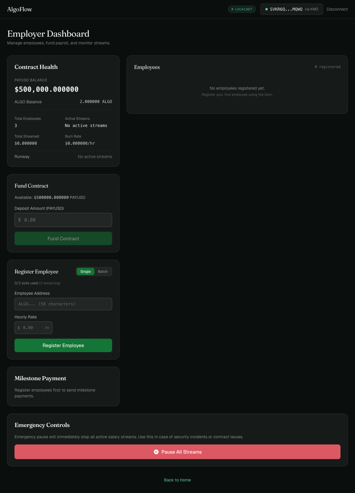
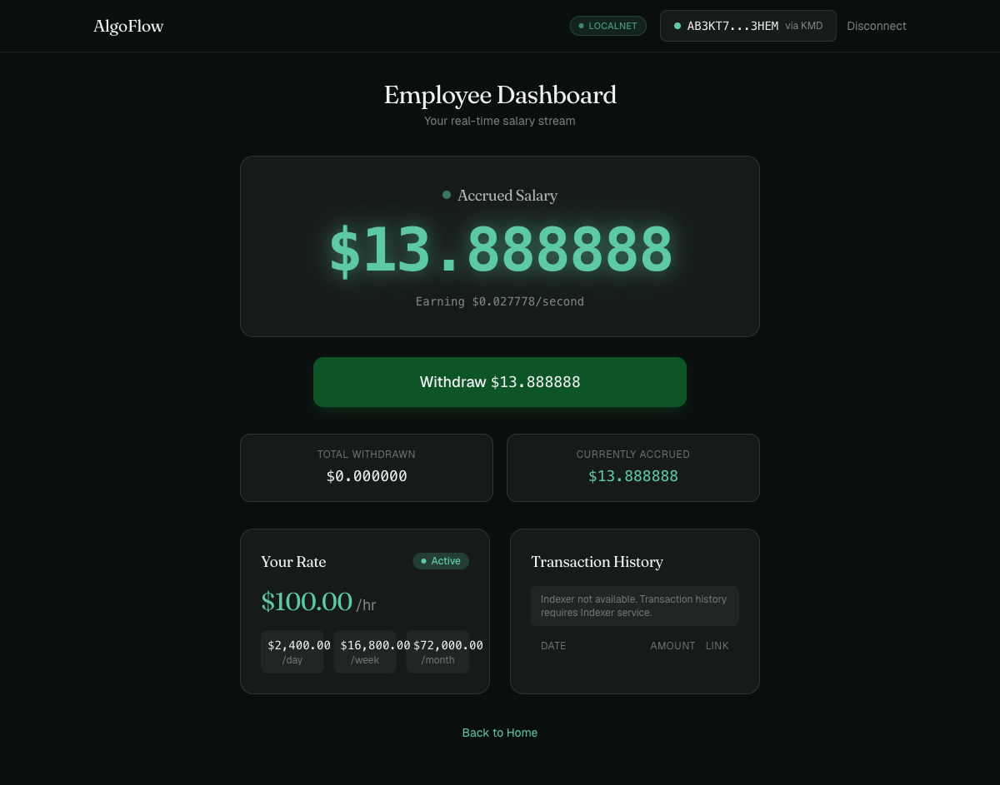

<p align="center">
  
  
  
  
  
</p>

<h1 align="center">AlgoFlow</h1>
<h3 align="center">Real-Time Programmable Payroll Infrastructure on Algorand</h3>

<p align="center">
  <em>Stream salaries every second. Withdraw anytime. Trustless, transparent, on-chain.</em>
</p>

---

## :rotating_light: Problem Statement

Traditional payroll is fundamentally broken:

- **Delayed payments** -- Employees wait weeks or months to receive earned wages. Cash flow is unpredictable.
- **Opacity** -- Workers have no visibility into when or how much they'll be paid until payday arrives.
- **Trust dependency** -- Employees must trust employers (and banks, and payroll processors) to pay correctly and on time.
- **High friction** -- Cross-border payments involve intermediaries, conversion fees, and multi-day settlement windows.
- **No programmability** -- Traditional payroll systems can't handle per-second accrual, instant bonuses, or conditional payouts.

For DAOs, remote-first teams, and the global digital workforce, these problems are amplified. There is no transparent, real-time, programmable payroll system -- until now.

---

## :bulb: Our Solution

**AlgoFlow** is a decentralized payroll streaming platform built on the Algorand blockchain. Employers fund smart contracts with tokenized salary units (PAYUSD, an Algorand Standard Asset), which stream continuously to employees. Employees withdraw accrued earnings **at any time** with instant on-chain settlement.

No intermediaries. No delays. No trust required.

The streaming is **math-based, not transaction-based** -- the contract calculates `rate x elapsed_time / 3600` on demand, meaning zero gas is wasted on per-second transactions. The frontend renders a smooth 60fps counter that shows earnings ticking up in real time, while the actual settlement happens atomically on withdrawal.

---

## :sparkles: Key Features

| Feature | Description |
|---------|-------------|
| **Real-Time Salary Streaming** | Salary accrues every second using on-chain math (`rate x elapsed / 3600`). No per-transaction overhead -- compute happens only on withdrawal. |
| **Instant Withdrawal** | Employees claim all accrued salary with a single click. Inner transactions settle instantly (~3.3s finality). |
| **Employer Dashboard** | Full management suite: fund the contract pool, register employees, adjust rates, pause/resume streams, send milestone bonuses. |
| **Employee Dashboard** | Live streaming counter at 60fps showing earnings ticking up in real time. One-click withdraw, transaction history, rate display. |
| **Milestone / Bonus Payments** | Employers can send one-time bonus payments to any employee outside the regular stream. |
| **Emergency Controls** | Global pause button freezes all active streams instantly. Resume individually or all at once. |
| **Multi-Unit Rate Display** | View salary rate in $/hr, $/day, $/week, or $/month with a single toggle. |
| **PAYUSD Stablecoin Analog** | Salary paid in PAYUSD (Algorand Standard Asset with 6 decimals), analogous to USDT. 1 PAYUSD = $1.00. |
| **Overdraft Protection** | Contract enforces withdrawal caps -- employees can never claim more than the pool balance, even if accrued exceeds it. |
| **Glassmorphism UI** | Premium dark-theme design with frosted glass cards, mouse-tracking spotlight effects, shimmer text, and a Three.js 3D animated background. |

---

## :hammer_and_wrench: Tech Stack

| Layer | Technology | Details |
|-------|------------|---------|
| **Smart Contracts** | Algorand Python (`algopy`) | Typed Python compiled to AVM bytecode via PuyaPy. ARC4-compliant ABI. |
| **Frontend** | React 19 + TypeScript + Vite | Single-page app with role-based routing (employer / employee). |
| **Styling** | Tailwind CSS 4 | Custom glassmorphism design system with dark theme. |
| **3D / Animation** | Three.js (Silk background) | Procedural 3D fragment shader with noise. 60fps `requestAnimationFrame` streaming counter. |
| **Wallet** | `@txnlab/use-wallet-react` | KMD provider for LocalNet development, Pera Wallet for Testnet. |
| **Network** | Algorand LocalNet / Testnet | ~3.3s block finality, 0.001 ALGO transaction fees. |
| **Tooling** | AlgoKit CLI | Project scaffolding, compilation, deployment, local network management. |
| **SDK** | `py-algorand-sdk` (`algosdk`) | Transaction building, indexer queries, account management. |
| **Testing** | pytest + Vitest + Playwright | Contract unit tests, frontend unit tests, E2E tests. |

---

## :building_construction: Architecture

```
                    +------------------+
                    |   Employer Wallet |
                    +--------+---------+
                             |
                    1. Deploy + Fund PAYUSD
                             |
                             v
              +------------------------------+
              |     PayrollStream Contract    |
              |------------------------------|
              |  Global State:               |
              |    employer, salary_asset,    |
              |    total_employees,           |
              |    total_streamed, is_paused  |
              |                              |
              |  Local State (per employee): |
              |    salary_rate, stream_start, |
              |    last_withdrawal,           |
              |    total_withdrawn, is_active |
              +-----+--------+--------+------+
                    |        |        |
         2. Register employees with hourly rates
                    |        |        |
                    v        v        v
              Employee A  Employee B  Employee C
                    |        |        |
         3. Accrual = rate x elapsed_time / 3600
            (calculated on-chain at withdrawal)
                    |        |        |
                    v        v        v
              4. Withdraw anytime via inner transaction
                 (instant settlement, ~3.3s finality)
```

### How Streaming Works

1. **Employer deploys** the PayrollStream contract, specifying the PAYUSD salary asset.
2. **Employer funds** the contract pool with PAYUSD tokens.
3. **Employer registers** employees with per-hour salary rates (in base units).
4. **Salary accrues mathematically** -- the contract computes `salary_rate x (now - last_withdrawal) / 3600` on demand. No transactions are sent per second.
5. **Employee withdraws** at any time -- the contract calculates the owed amount and executes an inner `AssetTransfer` to the employee's wallet.
6. **Frontend counter** uses `requestAnimationFrame` for a smooth 60fps visual of earnings ticking up, synchronized with on-chain state.

---

## :scroll: Smart Contract Methods

All 14 ABI methods implemented in `smart_contracts/payroll_stream/contract.py`:

| # | Method | Caller | Description |
|---|--------|--------|-------------|
| 1 | `create(asset)` | Employer | Initialize contract with the PAYUSD salary asset |
| 2 | `opt_in_asset()` | Employer | Contract opts into the salary ASA to receive tokens |
| 3 | `fund(axfer)` | Employer | Deposit PAYUSD salary tokens into the contract pool |
| 4 | `register_employee(account, rate)` | Employer | Register an employee with an hourly salary rate |
| 5 | `withdraw()` | Employee | Claim all accrued salary via inner transaction |
| 6 | `get_accrued(account)` | Anyone | Read-only: view an employee's current accrued balance |
| 7 | `update_rate(account, new_rate)` | Employer | Settle accrued at old rate, then apply new rate |
| 8 | `pause_stream(account)` | Employer | Settle accrued earnings, then pause an employee's stream |
| 9 | `resume_stream(account)` | Employer | Resume a paused stream (resets last_withdrawal to now) |
| 10 | `remove_employee(account)` | Employer | Final payout + deregister employee |
| 11 | `milestone_pay(employee, amount)` | Employer | One-time bonus/milestone payment via inner transaction |
| 12 | `pause_all()` | Employer | Emergency: pause all active streams globally |
| 13 | `resume_all()` | Employer | Resume all paused streams (stretch) |
| 14 | `drain_funds()` | Employer | Withdraw remaining pool balance (emergency, stretch) |

### On-Chain State Schema

**Global State** (4 UInt64 + 1 byte-slice):

| Key | Type | Description |
|-----|------|-------------|
| `employer` | Account | Address of the employer who deployed the contract |
| `salary_asset` | Asset | ASA ID of the PAYUSD salary token |
| `total_employees` | UInt64 | Count of active registered employees |
| `total_streamed` | UInt64 | Cumulative tokens disbursed across all employees |
| `is_paused` | UInt64 | Global pause flag (0 = active, 1 = paused) |

**Local State** (5 UInt64 per employee):

| Key | Type | Description |
|-----|------|-------------|
| `salary_rate` | UInt64 | Tokens per hour (in base units, 6 decimals) |
| `stream_start` | UInt64 | Unix timestamp when streaming began |
| `last_withdrawal` | UInt64 | Unix timestamp of most recent withdrawal |
| `total_withdrawn` | UInt64 | Cumulative tokens withdrawn by this employee |
| `is_active` | UInt64 | Stream status (0 = paused, 1 = active) |

---

## :rocket: Setup & Run

### Prerequisites

- **Python 3.12+**
- **Node.js 22+**
- **Docker** (for AlgoKit LocalNet)
- **AlgoKit CLI** (`pipx install algokit`)

### Clone & Install

```bash
# Clone the repository
git clone https://github.com/pranayvaddanam/infinova-hackathon.git
cd infinova-hackathon

# Python environment
python -m venv .venv
source .venv/bin/activate    # macOS/Linux
pip install -r requirements.txt

# Frontend dependencies
cd frontend
npm install
cd ..
```

### Start LocalNet

```bash
# Start the local Algorand network (requires Docker)
algokit localnet start

# Verify it's running
algokit localnet status
```

### Compile & Deploy

```bash
# Compile the smart contract
algokit compile python smart_contracts/payroll_stream/contract.py

# Deploy contract + create PAYUSD token on LocalNet
python scripts/deploy.py --network localnet
# Note the APP_ID and ASSET_ID from the output

# Fund test employee accounts and register them
python scripts/fund_accounts.py --network localnet --app-id <APP_ID> --asset-id <ASSET_ID>
```

### Configure Environment

```bash
# Copy the example env file
cp .env.example .env

# Edit .env with your deployed values:
#   VITE_APP_ID=<your-app-id>
#   VITE_ASSET_ID=<your-asset-id>
#   VITE_NETWORK=localnet
#   VITE_ALGOD_SERVER=http://localhost:4001
#   VITE_ALGOD_TOKEN=aaaaaaaaaaaaaaaaaaaaaaaaaaaaaaaaaaaaaaaaaaaaaaaaaaaaaaaaaaaaaaaa
```

### Run the Frontend

```bash
cd frontend
npm run dev
# Open http://localhost:5173
```

### Run Tests

```bash
# Smart contract tests
pytest --tb=short

# Frontend unit tests
cd frontend
npm run test

# Type checking
npx tsc --noEmit
```

---

## :file_folder: Project Structure

```
infinova-hackathon/
├── smart_contracts/
│   └── payroll_stream/
│       ├── contract.py              # PayrollStream ARC4 contract (14 ABI methods)
│       └── PayrollStream.arc56.json # Compiled ABI specification
├── scripts/
│   ├── deploy.py                    # Deploy contract + create PAYUSD token
│   ├── fund_accounts.py             # Fund and register test employees
│   └── demo.py                      # Live demo script (9-step flow)
├── frontend/
│   ├── src/
│   │   ├── App.tsx                  # Main app with role-based routing
│   │   ├── components/
│   │   │   ├── Landing.tsx          # Landing page with role selection
│   │   │   ├── HowItWorks.tsx       # How it works diagram
│   │   │   ├── EmployerDashboard.tsx # Employer management suite
│   │   │   ├── EmployeeDashboard.tsx # Employee view with streaming counter
│   │   │   ├── StreamCounter.tsx    # 60fps real-time accrual display
│   │   │   ├── WalletConnect.tsx    # Wallet connection (KMD / Pera)
│   │   │   ├── RegisterForm.tsx     # Employee registration form
│   │   │   ├── ContractHealth.tsx   # Pool balance & runway display
│   │   │   ├── EmergencyControls.tsx # Global pause/resume controls
│   │   │   ├── TransactionHistory.tsx # On-chain transaction log
│   │   │   ├── WithdrawButton.tsx   # One-click salary withdrawal
│   │   │   ├── RateDisplay.tsx      # Multi-unit rate display
│   │   │   ├── NetworkBadge.tsx     # Network indicator badge
│   │   │   ├── Silk.tsx             # Three.js 3D animated background
│   │   │   ├── SpotlightCard.tsx    # Mouse-tracking spotlight cards
│   │   │   └── ShinyText.tsx        # Shimmer gradient text
│   │   ├── hooks/
│   │   │   ├── usePayrollContract.ts # Contract interaction hook
│   │   │   ├── useStreamAccrual.ts  # Real-time accrual calculation
│   │   │   └── useContractState.ts  # Contract state management
│   │   ├── lib/
│   │   │   ├── utils.ts             # Formatters, address truncation
│   │   │   └── PayrollStream.arc56.json # Frontend ABI copy
│   │   └── index.css                # Global styles + Tailwind
│   ├── vite.config.ts
│   └── package.json
├── tests/
│   ├── test_payroll_stream.py       # Contract unit tests
│   └── test_integration.py          # Full-flow integration tests
├── docs/                            # Planning artifacts (PRD, architecture, data model)
├── CLAUDE.md                        # Project conventions & documentation
├── .env.example                     # Environment variable template
├── requirements.txt                 # Python dependencies
└── pyproject.toml                   # Python project config
```

---

## :camera: Screenshots

<!-- Add screenshots here -->

| Landing Page | Employer Dashboard |
|:---:|:---:|
|  |  |

| Employee Dashboard | Employee Streaming |
|:---:|:---:|
|  |  |

---

## :shield: Security

- **On-chain authorization** -- Every contract method validates `Txn.sender` against the employer or registered employee address.
- **Math-based accrual** -- Withdrawal amounts are computed on-chain from timestamps. Employees cannot claim more than earned.
- **Overdraft protection** -- Withdrawals are capped at the contract's available pool balance.
- **Atomic transactions** -- Multi-step operations use Algorand atomic groups (all succeed or all fail).
- **Inner transactions** -- Payouts are initiated by the contract itself, not external signers.
- **Wallet security** -- Private keys never leave the wallet app (KMD / Pera via WalletConnect).
- **No exposed secrets** -- Mnemonics stored only in `.env` (never committed). Frontend uses only `VITE_`-prefixed public values.

---

## :gear: Environment Variables

| Variable | Description | Example |
|----------|-------------|---------|
| `VITE_APP_ID` | Deployed application ID | `1001` |
| `VITE_ASSET_ID` | PAYUSD asset ID | `1002` |
| `VITE_NETWORK` | Network identifier | `localnet` or `testnet` |
| `VITE_ALGOD_SERVER` | Algod node URL | `http://localhost:4001` |
| `VITE_ALGOD_TOKEN` | Algod API token | `aaa...` (64 chars for LocalNet) |
| `DEPLOYER_MNEMONIC` | 25-word mnemonic (server-side only) | *never commit* |

---

## :trophy: Built For

<p align="center">
  <strong>Infinova Hackathon 2026</strong><br/>
  Blockchain with Algorand Track -- Option 1<br/><br/>
  <em>Real-time programmable payroll infrastructure for the decentralized workforce.</em>
</p>

---

<p align="center">
  Built with Algorand Python, React 19, and Three.js<br/>
  <sub>AlgoFlow -- Because payday should be every second.</sub>
</p>
